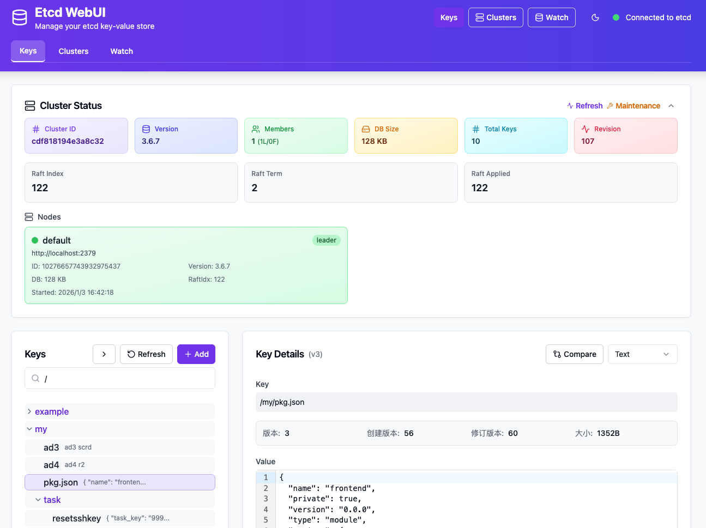

# etcd-webui

[English](README.md) | [简体中文](README.zh-CN.md)

一个现代化的 etcd Web UI，使用 Vite + React + TypeScript 构建前端，Golang 构建后端。



## 架构

该项目采用**类单仓库结构**，前端和后端位于不同的目录中：

```
etcd-webui/
├── frontend/          # Vite + React + TypeScript 前端
│   ├── src/
│   │   ├── components/   # React 组件
│   │   │   └── ui/       # ShadCN UI 组件
│   │   ├── hooks/        # 自定义 React hooks
│   │   ├── lib/          # 工具函数
│   │   └── services/     # API 服务层
│   ├── public/           # 静态资源
│   └── package.json      # 前端依赖
│
├── backend/           # Golang 后端
│   ├── handlers/      # HTTP 处理器
│   ├── models/        # 数据模型
│   └── config.yaml    # 后端配置
│
└── README.md          # 本文档
```

### 前端架构

- **构建工具**: Vite (快速开发和优化的生产构建)
- **框架**: React 19 + TypeScript
- **UI 组件**: ShadCN UI + Tailwind CSS
- **状态管理**: React useState/useEffect hooks
- **HTTP 客户端**: 自定义 API 服务层
- **代码编辑器**: CodeMirror (支持 JSON/YAML 语法高亮)
- **差异查看器**: word-diff (用于版本比较)

**重要说明**：前端构建为**静态 HTML/JS/CSS 包**，由 Go 后端提供服务。它不能独立运行，因为：

1. 所有 API 调用都代理到后端 (`/api/*` 端点)
2. 后端从 `frontend/dist/` 目录提供静态文件
3. 不存在模拟 API 或独立服务器模式

### 后端架构

- **框架**: Gin (Go Web 框架)
- **数据库**: etcd v3 (键值存储)
- **静态文件服务**: 提供来自 `frontend/dist/` 的前端构建
- **API 层**: 用于 etcd CRUD 操作的 RESTful 端点

## 部署模型

```
┌─────────────────────────────────────────────────┐
│                    浏览器                       │
│                                                  │
│   http://localhost:8080 (Go 后端)               │
│              │                                   │
│              ▼                                   │
│   ┌─────────────────────────────────┐           │
│   │    Go 后端 (Gin)                │           │
│   │                                 │           │
│   │   /api/*  →  etcd v3            │           │
│   │   /*       →  静态文件          │           │
│   │     (frontend/dist/index.html)  │           │
│   └─────────────────────────────────┘           │
│              │                                   │
│              ▼                                   │
│      ┌─────────────────┐                         │
│      │   etcd v3       │                         │
│      │ localhost:2379  │                         │
│      └─────────────────┘                         │
└─────────────────────────────────────────────────┘
```

## 前置条件

- Go 1.21+
- Node.js 18+
- 运行在 localhost:2379 的 etcd v3 服务

## 快速开始

### 1. 构建前端

```bash
cd frontend
npm install
npm run build
```

### 2. 启动后端

```bash
cd backend
go mod download
go run main.go --config config.yaml
```

### 3. 访问 UI

在浏览器中打开 http://localhost:8080

## 配置

编辑 `backend/config.yaml` 文件进行配置：

- `etcd_endpoint`: etcd 服务器地址 (默认: localhost:2379)
- `server_port`: Web 服务器端口 (默认: 8080)
- `static_dir`: 前端构建输出目录
- `dial_timeout`: etcd 连接超时时间 (秒)
- `username`: etcd 认证用户名 (可选)
- `password`: etcd 认证密码 (可选)

## 开发模式

### 前端开发

```bash
cd frontend
npm install
npm run dev
```

这将启动 Vite 开发服务器，但请注意，您仍然需要运行后端来处理 API 请求。

### 后端开发

```bash
cd backend
go mod download
go run main.go --config config.yaml
```

## 测试

### 前端测试

```bash
cd frontend
npm run test
```

### 后端测试

```bash
cd backend
go test ./...
```

## 代码风格检查

### 前端

```bash
cd frontend
npm run lint
```

### 后端

```bash
cd backend
go fmt ./...
go vet ./...
```

## 构建生产版本

### 1. 构建前端

```bash
cd frontend
npm install
npm run build
```

### 2. 构建后端

```bash
cd backend
go build -o etcd-webui main.go
```

### 3. 运行生产版本

```bash
./etcd-webui --config config.yaml
```

## Docker 部署

### 构建 Docker 镜像

```bash
docker build -t etcd-webui:latest .
```

### 使用 Docker 运行

基本用法（连接到主机上的 etcd）：

```bash
docker run -d \
  --name etcd-webui \
  -p 8080:8080 \
  --network host \
  etcd-webui:latest
```

使用自定义 etcd 端点（如果 etcd 在另一个容器或远程服务器）：

```bash
docker run -d \
  --name etcd-webui \
  -p 8080:8080 \
  -e ETCD_ENDPOINT=etcd-server:2379 \
  etcd-webui:latest
```

使用自定义配置文件：

```bash
docker run -d \
  --name etcd-webui \
  -p 8080:8080 \
  -v /path/to/config.yaml:/app/backend/config.yaml \
  etcd-webui:latest \
  --config /app/backend/config.yaml
```

使用 Docker Compose 运行：

```yaml
version: '3.8'
services:
  etcd-webui:
    image: etcd-webui:latest
    container_name: etcd-webui
    ports:
      - "8080:8080"
    environment:
      - ETCD_ENDPOINT=etcd:2379
    depends_on:
      - etcd
    networks:
      - etcd-network

  etcd:
    image: quay.io/coreos/etcd:v3.5.10
    container_name: etcd
    environment:
      - ETCD_ADVERTISE_CLIENT_URLS=http://etcd:2379
      - ETCD_LISTEN_CLIENT_URLS=http://0.0.0.0:2379
    networks:
      - etcd-network

networks:
  etcd-network:
    driver: bridge
```

### 环境变量

可以使用以下环境变量来配置应用程序：

- `ETCD_WEBUI_SERVER_PORT`: 服务器端口（默认: 8080）
- `ETCD_WEBUI_LOG_LEVEL`: 日志级别 - debug, info, warn, error（默认: info）

## 功能特点

- ✅ 集群状态监控
- ✅ 键值对管理 (增删改查)
- ✅ JSON/YAML 语法高亮
- ✅ 键值历史记录和差异比较
- ✅ 键前缀搜索和过滤
- ✅ 实时监控 (Watch)
- ✅ 多集群支持
- ✅ 认证支持

## 贡献

欢迎提交 Issue 和 Pull Request！
